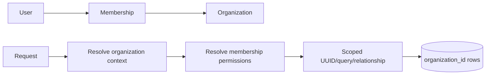

# Organization tenancy

Sky Fundi implements shared-database, row-owned tenancy. `organizations.id` is a UUID; operational records carry `organization_id`. Database-per-organization routing is not implemented.

An authenticated user can have multiple Identity memberships. `ResolveOrganizationContext` establishes one active, authorized organization for a request and verifies relevant state. Module middleware and services then scope list queries, UUID resolution, relationships, uniqueness, writes, exports, and audit context. Client payloads cannot select ownership.

Foreign organization identifiers return `404` or scoped validation errors. A platform-wide exception requires an explicit Core service, platform permission, and audit trail. Queue jobs and commands operating on organization data must carry context explicitly; workers do not inherit web state.

Organization `type` is configuration-driven. Manifests declare supported types inconsistently across older modules and the runtime does not use those declarations as an isolation mechanism. Adding a type must not weaken the shared ownership boundary.
