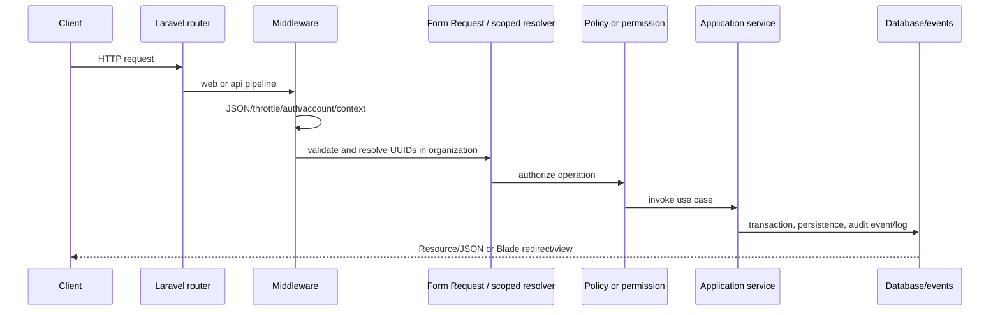

# Runtime architecture

## Module discovery and providers

Composer maps `Core\` to `core/` and `Modules\` to `modules/`. `bootstrap/providers.php` explicitly loads Core and module service providers in dependency-safe order. Providers register bindings in `register()` and load migrations, routes, policies, listeners, middleware aliases, or commands in `boot()`.

`Core\Modules\Application\ModuleManager` discovers `modules/*/module.json` and persists registry/install/enable state. This state does not currently unload an explicitly registered provider, so registry enablement is entitlement/data state rather than dynamic PHP code loading.

## Request lifecycle

The API group prepends `ForceJsonResponse` and appends authenticated account-state enforcement, API request logging, and `throttle:api-default`. Middleware priority ensures the account check runs after Sanctum authentication. Route groups add permission, organization-context, and resource-scoping middleware as needed. Web forms use Laravel's `web` middleware and CSRF protection. A global response middleware adds the compatible security-header baseline documented in the security policy.

## Organization isolation, UUIDs, and RBAC

Identity resolves an active membership and organization from trusted session/request state. Organization-owned services scope lists, lookups, relations, uniqueness, and writes by `organization_id`; module resolvers convert foreign UUIDs into `404` rather than revealing them. Payload ownership is not trusted. UUID primary keys reduce enumerable identifiers but do not replace authorization.

Permissions are seeded namespaced strings and resolved through RBAC plus active membership. `EnsurePermission`, Form Request authorization, and registered policies provide enforcement. Organization, Learner, Attendance, Assessment, Report, and Scheduling models have policies; Academics and Staff primarily use route/Form Request/service permission checks.

## Auditing and security

Events implementing `Auditable` are captured by the audit subscriber; services also record explicit before/after actions where no event exists. Audit API access is read-only. Authentication uses session auth for Blade and Sanctum tokens for APIs, with throttling, account-lock checks, password reset/verification flows, trusted devices, session control, optional IP restrictions, validation, guarded/fillable models, encrypted organization AI credentials, and sensitive-data logging prohibitions. Two-factor enforcement is not implemented.

## AI, storage, queue, and scheduling

`AIManager` and provider registry are the only AI-provider boundary. Ollama and DeepSeek are functioning HTTP adapters; OpenAI, Claude, and Gemini are registered placeholders. Modules contain no direct provider SDK calls. Storage similarly exposes live local/S3 implementations and placeholder Azure/GCS adapters. Notifications are the only current queued application workload. The Scheduler provider owns recurring platform maintenance and backup commands; domain Scheduling is a separate module for timetables and lessons.

## Configuration

Laravel configuration lives in `config/`; Academics and Organizations also publish/load module configuration. `.env` supplies environment-specific values and must remain secret. Platform Settings are global. Organization settings/branding/AI configuration are separate organization-owned records; Academics education settings still use the platform-global Settings store and are documented as a limitation.
