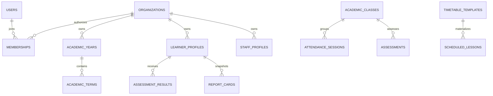

# Database conventions and implemented schema

Sky Fundi uses MySQL 8/InnoDB in Docker and SQLite in-memory for the default PHPUnit configuration. The production-shaped migration check uses an isolated temporary MySQL database.

## Identity and ownership

- Application entity primary keys are UUID strings named `id`, normally generated with `Core\Support\Traits\HasUuidPrimaryKey`.
- Tenant-owned rows use a UUID `organization_id` foreign key to `organizations.id`. `tenant_id` is not the implemented boundary.
- Users may belong to multiple organizations through Identity memberships. Active request context selects one authorized organization.
- Core configuration/registry tables may be platform-global; module operational tables are organization-owned unless their migration explicitly says otherwise.

## Major table groups

| Owner | Tables/capability |
|---|---|
| Core | `users`, password reset/tokens/sessions, RBAC roles/permissions and pivots, memberships, audit logs, settings, notification infrastructure, modules, licenses, subscriptions, deployment profiles, feature flags, analytics events, security-centre tables, cache and queue tables |
| Organizations | organizations, settings, AI configuration, modules, administrators |
| Academics | curricula, departments, academic years/terms, grades/classes/subjects, calendar entries, timetable periods |
| Staff/Learners | staff profiles; learner profiles, number sequences, immutable status histories |
| Attendance/Assessments | attendance sessions/entries; categories, assessments, results |
| Reports | grading scales/bands, reporting periods, templates, report cards, subject snapshots, comments |
| Scheduling | rooms, timetable templates/entries, scheduled lessons, schedule change logs |

See the owning migration and module README for exact columns. Optional integration foreign keys use explicit delete behavior; preserved historical records generally restrict or null references rather than cascade business history.

## Constraints and indexes

- Foreign keys enforce referential integrity and are indexed.
- Organization-local identifiers use composite uniqueness, such as `(organization_id, code)` and organization-scoped learner numbers.
- Composite indexes follow real list/filter/conflict queries, commonly ownership plus status/date/reference.
- Scheduling uses overlap checks in Application code plus uniqueness for idempotent template materialization.
- Soft deletion is used where the owning model/migration implements restoration; it is not assumed universally.

## Migration rules

Migrations live with the owner, are timestamped and additive by default, use the referenced table's exact key type, and implement `down()` in reverse dependency order. Do not edit a deployed migration. Seeders are idempotent and contain no secrets. Validate forward migration, seed, rollback, and re-migration with `make migrate-check`.

