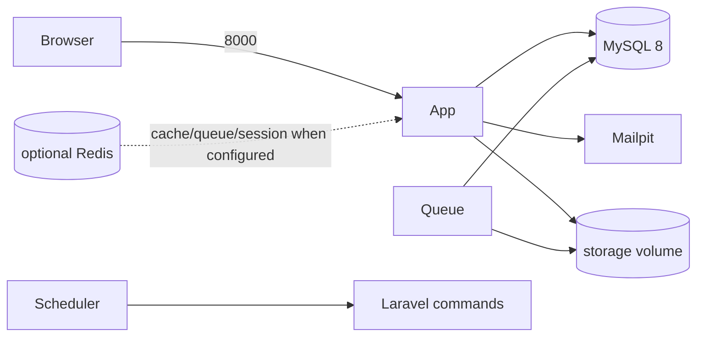

# Deployment and runtime operations

The committed deployment artifact is a development-oriented Docker Compose stack. Production orchestration and infrastructure-as-code are not implemented.

## Compose services

| Service | Purpose | Exposure |
|---|---|---|
| `init` | waits for MySQL, creates missing `.env`, installs locked dependencies, creates a missing key | one-shot |
| `app` | `php artisan serve`; `/up` container health check | `8000` |
| `mysql` | MySQL 8 with persistent volume | host `3307` |
| `mailpit` | local SMTP capture/UI | `1025`, `8025` |
| `queue` | `queue:work --sleep=3 --tries=3` | internal |
| `scheduler` | `schedule:work` | internal |
| `redis` | optional Redis 7 profile | internal |

The source tree and named `storage` volume are mounted into PHP containers. The default queue connection is database; Redis is optional configuration, not required by the stack.



## Local startup and health

```bash
make init
make up
make health
docker compose ps
```

`/up` is Laravel's public liveness endpoint. `/api/v1/health` is the public minimal application check; `/api/v1/health/detailed` requires authentication and `core.health.view`. Mailpit is development-only.

## Queue and scheduler

Laravel owns dispatch and drivers. The only queued application class currently found is `CoreNotification`, routed to the `notifications` queue; `Core\Queue\Domain\QueueName` reserves the platform queue names. The scheduler runs health checks hourly; license validation, subscription validation, temporary-file cleanup and AI-cache cleanup daily; queue cleanup and backup weekly. Scheduled commands run in the dedicated Compose service.

## Configuration and storage

Use `.env.example` and [environment variable reference](../environment-variables.md); never commit `.env`. `config/filesystems.php` and `core/Storage` expose local and S3 implementations, with Azure/GCS adapters explicitly placeholders. Durable multi-node deployments must configure shared/object storage. AI and mail provider availability depends on configured adapters; placeholder adapters must not be represented as live.

## Production checklist

- provide PHP 8.3+, MySQL 8-compatible storage, TLS termination, a production web server, durable shared storage, queue workers, and one scheduler;
- inject secrets through the hosting platform and set production app/debug/session/cookie/cache/queue/mail/storage settings;
- run locked dependency installation, migrations, `make verify` in a release environment, and authenticated health checks;
- configure worker supervision, log aggregation/retention, rate-limit-aware proxies, and database/storage backups;
- test restore procedures separately: `platform:backup` exists, but automated restore does not;
- do not deploy Mailpit, `artisan serve`, committed development database credentials, or bind MySQL publicly as production defaults.

See [environments](environments.md) and [operations](../operations/README.md) for limitations and runbooks.
